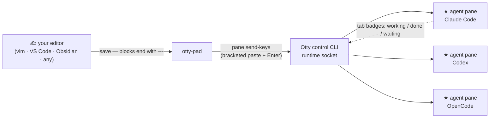

<div align="center">

# grip-otty

**Write prompts in your own editor. Ship them into any AI agent pane.**

[](https://github.com/CodeTonight-SA/grip-otty/actions/workflows/ci.yml)
[](LICENSE)
[](pyproject.toml)
[](#field-notes-otty-110--122)
[](pyproject.toml)



</div>

An unofficial toolkit for [Otty](https://otty.sh) — the native macOS terminal
built for AI code agents. The pane can run **Claude Code, Codex, OpenCode, or
anything with a stdin**: `otty-pad` delivers your prompt as keystrokes, so the
harness doesn't matter. Python, **zero runtime dependencies**.

> **Unofficial.** Not affiliated with or endorsed by Otty (an appmakes.io
> product). Contains **no Otty code** — it drives Otty's public, documented
> control CLI, and the optional hook wrapper execs Otty's *own* installed,
> code-signed hook. Built against **Otty 1.1.0** (2026-07-02) and rechecked
> against **Otty 1.2.2** (2026-07-07) where noted below.

## Why

Otty runs AI agent sessions as first-class panes. Once several are running,
two things become valuable:

1. **Writing prompts in a real editor** — history, multi-line editing, your
   own keybindings — instead of a terminal input box.
2. **Scripting the panes** — list, send, read back, badge — from plain Python.

`otty-pad` is #1. `otty_pad.transport` is #2.

## How it works



## Install

```bash
pipx install git+https://github.com/CodeTonight-SA/grip-otty
# or: uv tool install git+https://github.com/CodeTonight-SA/grip-otty
```

## Enable prompt-sending (one-time, deliberate)

Otty ships with `ipc-allow-send-keys` **off**. That is a good security
default: enabling it allows any local process to inject keystrokes into any
pane. Turn it on only if you're comfortable with that trade on your machine:

```bash
otty config set ipc-allow-send-keys true
otty config reload    # required — a running app does not pick the key up without it
```

## Quickstart

```bash
otty-pad --list                 # panes; likely agent sessions are starred
otty-pad                        # pick a pane → your $EDITOR opens → save+quit sends
otty-pad --split                # the pad as its own Otty split pane
otty-pad --watch ideas.md       # any editor, any app: a `---` line + save ships the block
otty-pad --all --send "run the tests"   # broadcast to every agent pane at once
otty-pad --info                 # fail-soft version/config/integration snapshot
otty-pad --plain --list         # ASCII output for screen readers/plain terminals
```

Pad file rules: `#>` lines are chrome/receipts and never send; a line that is
exactly `---` separates prompts. In watch mode **only** `---`-terminated
blocks ship — **an autosave of a half-typed thought never sends** (that
property is a test). Prompt journals live in `$XDG_STATE_HOME/otty-pad`
(default `~/.local/state/otty-pad`).

## The transport API

```python
from otty_pad import transport as ot

ot.is_available()                      # False on machines without Otty — never raises
panes = ot.pane_list()                 # [{'id': 'p_…', 'process': '⠐ …', 'cwd': …}, …]
agents = ot.agent_panes(panes)         # heuristic: braille-spinner/✳ titles + harness names
ot.send_prompt(agents[0]["id"], "explain this traceback:\n…")   # bracketed paste + Enter
print(ot.capture(agents[0]["id"]))     # full-screen text read-back
ot.badge(agents[0]["id"], "unread")    # kinds: running/completed/finished/unread/error/awaiting-input
new_id = ot.split_pane(direction="right", title="scratch")      # returns the NEW pane id
```

Everything goes through one `_run()` boundary with an injectable runner —
the whole package tests without Otty installed (`pytest`, 46 tests, CI runs
them on macOS and Linux).

## Field notes (Otty 1.1.0 → 1.2.2)

| Behaviour | Detail |
|---|---|
| Otty version recheck | Local live probe returned `otty 1.2.2` on 2026-07-07. Behaviour below says exactly what was observed versus changelog-inferred. |
| send-keys disabled by default | `config get ipc-allow-send-keys` returned `true` on the test machine. The documented safe setup remains `config set ... true` **and** `config reload`; `grip-otty` never enables it implicitly. |
| **Empty `--pane` targets are refused here** | learned from a 1.1.0 live near-miss where an empty target acted on the focused pane. Even if newer Otty builds get safer, this package keeps the guard for old-version safety. |
| Background pane targeting | Otty 1.2.2 changelog says `--pane` targeting works across background tabs for send-keys, capture, and show commands. `grip-otty` already targets by explicit pane id, so this should make existing sends more reliable. |
| `pane split` id | 1.1.0 needed before/after `pane list` diff. `split_pane()` now prefers an id if future JSON output returns one, then falls back to the diff. |
| `pane capture --lines N` | returns the BOTTOM N rows; use full capture to verify sends. |
| Agent detection | observed 1.2.2 `pane list --json` still had no `agent` field. `agent_panes()` now prefers `agent` / `agent_kind` / `agentKind` / `harness` if Otty adds one, otherwise keeps the title heuristic. |
| AppleScript automation | Otty 1.2.2 adds AppleScript automation. This package has not wrapped it yet because the local AppleScript dictionary could not be extracted with Command Line Tools-only `sdef`; exact syntax would be guesswork. |
| BiDi / RTL | Otty 1.2.2 keeps paste/copy/scrollback logical while rendering visually reordered text. `otty-pad` deliberately preserves prompt strings in logical order; tests cover Hebrew, Arabic, and mixed-direction prompts. |
| Accessibility | Otty 1.2.2 improves VoiceOver. `otty-pad --plain` gives ASCII status/list output when Unicode glyphs are not desirable. |
| In-shell detection markers | `TERM_PROGRAM=otty`, `OTTY_BIN_DIR`; app bundle `/Applications/Otty.app` (override: `OTTY_APP_DIR`) |
| Chain-after-idle | `otty watch:claude <session-id> --timeout-secs N` (raw CLI) blocks until that session is idle — exit 0 idle / 4 unknown id / 9 timeout |

### Otty 1.2.2 notes for this toolkit

- AppleScript automation is the obvious next adapter, but the correct shape is
  a tiny optional module with one `osascript` boundary after exact syntax is
  verified. No guessed script strings are shipped here.
- New tabs inheriting the live cwd and improved `open -a Otty <folder>` routing
  make `otty-pad --split` fit better with project-local workflows.
- Tab badges showing real shell/process state and the spurious Claude task
  notification fix should reduce false status noise around agent panes.
- Global Hotkey and "New Window When All Windows Closed" are useful Otty
  settings when the pad is part of a daily agent cockpit, but they are not
  required by this package.

## Sharing one settings.json across a mixed team

If your team commits Claude Code's `settings.json` and only some machines
have Otty, see [`examples/gated-hooks/`](examples/gated-hooks/) — a tiny
wrapper that keeps Otty's tab-badge hooks alive where Otty exists and makes
them a silent ~2 ms no-op everywhere else. When Otty ships its Windows build,
the same committed entries simply come alive.

## Known limitations (read before adopting)

- **macOS only**, because Otty is macOS-only today (Windows/Linux are on
  Otty's waitlist). The transport fails soft everywhere else.
- **Version-aware, still cautious.** The split-id discovery dance and the
  title-based agent heuristic started as Otty 1.1.0 workarounds. They remain as
  fallbacks while the code prefers structured/direct responses if Otty exposes
  them.
- **Agent detection is a heuristic**, not a contract. Obvious editor commands
  such as `vim claude-notes.md` are ignored, but a custom pane title can still
  fool any title-based detector. Target by pane id when precision matters.
- **Send is fire-and-forget.** `send_prompt` confirms Otty accepted the keys,
  not that the harness understood them — use `capture()` to verify when it
  matters.
- **Watch mode tracks one file per process** and reads appends only; if you
  rewrite the file's history above the watermark, restart the watcher.
- **Not on PyPI yet** — install from git. It will be published if anyone
  besides us actually uses it (that's an honest maybe).

## Status & maintenance

Version-pinned honesty: built against **Otty 1.1.0**, rechecked against an
installed **Otty 1.2.2** on 2026-07-07 for the field notes above. Otty is a
fast-moving commercial product; if a future release supersedes this toolkit
natively, this repo will be **archived rather than left to rot**. Issues and
PRs welcome until then.

## License

MIT © 2026 [CodeTonight SA](https://codetonight.co.za)
