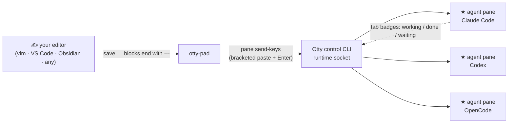

<div align="center">

# grip-otty

**Write prompts in your own editor. Ship them into any AI agent pane.**

[](https://github.com/CodeTonight-SA/grip-otty/actions/workflows/ci.yml)
[](LICENSE)
[](pyproject.toml)
[](#field-notes-otty-110-verified-live)
[](pyproject.toml)


</div>

An unofficial toolkit for [Otty](https://otty.sh) — the native macOS terminal
built for AI code agents. The pane can run **Claude Code, Codex, OpenCode, or
anything with a stdin**: `otty-pad` delivers your prompt as keystrokes, so the
harness doesn't matter. Python, **zero runtime dependencies**.

> **Unofficial.** Not affiliated with or endorsed by Otty (an appmakes.io
> product). Contains **no Otty code** — it drives Otty's public, documented
> control CLI, and the optional hook wrapper execs Otty's *own* installed,
> code-signed hook. Verified against **Otty 1.1.0** (2026-07-02).

## Why

Otty runs AI agent sessions as first-class panes. Once several are running,
two things become valuable:

1. **Writing prompts in a real editor** — history, multi-line editing, your
   own keybindings — instead of a terminal input box.
2. **Scripting the panes** — list, send, read back, badge — from plain Python.

`otty-pad` is #1. `otty_pad.transport` is #2.

## How it works



## Install

```bash
pipx install git+https://github.com/CodeTonight-SA/grip-otty
# or: uv tool install git+https://github.com/CodeTonight-SA/grip-otty
```

## Enable prompt-sending (one-time, deliberate)

Otty ships with `ipc-allow-send-keys` **off**. That is a good security
default: enabling it allows any local process to inject keystrokes into any
pane. Turn it on only if you're comfortable with that trade on your machine:

```bash
otty config set ipc-allow-send-keys true
otty config reload    # required — a running app does not pick the key up without it
```

## Quickstart

```bash
otty-pad --list                 # panes; likely agent sessions are starred
otty-pad                        # pick a pane → your $EDITOR opens → save+quit sends
otty-pad --split                # the pad as its own Otty split pane
otty-pad --watch ideas.md       # any editor, any app: a `---` line + save ships the block
otty-pad --all --send "run the tests"   # broadcast to every agent pane at once
```

Pad file rules: `#>` lines are chrome/receipts and never send; a line that is
exactly `---` separates prompts. In watch mode **only** `---`-terminated
blocks ship — **an autosave of a half-typed thought never sends** (that
property is a test). Prompt journals live in `$XDG_STATE_HOME/otty-pad`
(default `~/.local/state/otty-pad`).

## The transport API

```python
from otty_pad import transport as ot

ot.is_available()                      # False on machines without Otty — never raises
panes = ot.pane_list()                 # [{'id': 'p_…', 'process': '⠐ …', 'cwd': …}, …]
agents = ot.agent_panes(panes)         # heuristic: braille-spinner/✳ titles + harness names
ot.send_prompt(agents[0]["id"], "explain this traceback:\n…")   # bracketed paste + Enter
print(ot.capture(agents[0]["id"]))     # full-screen text read-back
ot.badge(agents[0]["id"], "unread")    # kinds: running/completed/finished/unread/error/awaiting-input
new_id = ot.split_pane(direction="right", title="scratch")      # returns the NEW pane id
```

Everything goes through one `_run()` boundary with an injectable runner —
the whole package tests without Otty installed (`pytest`, 39 tests, CI runs
them on macOS and Linux).

## Field notes (Otty 1.1.0, verified live)

| Behaviour | Detail |
|---|---|
| send-keys disabled by default | `config set ipc-allow-send-keys true` **and** `config reload` — set alone is a no-op in the running app |
| **Empty `--pane` targets the FOCUSED pane** | learned from a live near-miss — this package hard-refuses empty pane ids everywhere |
| `pane split` returns no id | discovered via before/after `pane list` diff (delete the dance if a future Otty returns it) |
| `pane capture --lines N` | returns the BOTTOM N rows; use full capture to verify sends |
| Agent detection | heuristic on the pane title (braille spinner / ✳ / harness names); prefer a structured field the moment `pane list --json` grows one |
| In-shell detection markers | `TERM_PROGRAM=otty`, `OTTY_BIN_DIR`; app bundle `/Applications/Otty.app` (override: `OTTY_APP_DIR`) |
| Chain-after-idle | `otty watch:claude <session-id> --timeout-secs N` (raw CLI) blocks until that session is idle — exit 0 idle / 4 unknown id / 9 timeout |

## Sharing one settings.json across a mixed team

If your team commits Claude Code's `settings.json` and only some machines
have Otty, see [`examples/gated-hooks/`](examples/gated-hooks/) — a tiny
wrapper that keeps Otty's tab-badge hooks alive where Otty exists and makes
them a silent ~2 ms no-op everywhere else. When Otty ships its Windows build,
the same committed entries simply come alive.

## Known limitations (read before adopting)

- **macOS only**, because Otty is macOS-only today (Windows/Linux are on
  Otty's waitlist). The transport fails soft everywhere else.
- **Version-welded to Otty 1.1.0 quirks.** The split-id discovery dance and
  the title-based agent heuristic are workarounds for 1.1.0 behaviour; a new
  Otty release can break or obsolete them (we've documented exactly which
  ones in the field notes above).
- **Agent detection is a heuristic**, not a contract. A pane titled
  `vim claude-notes.md` will be mis-starred. Target by pane id when precision
  matters.
- **Send is fire-and-forget.** `send_prompt` confirms Otty accepted the keys,
  not that the harness understood them — use `capture()` to verify when it
  matters.
- **Watch mode tracks one file per process** and reads appends only; if you
  rewrite the file's history above the watermark, restart the watcher.
- **Not on PyPI yet** — install from git. It will be published if anyone
  besides us actually uses it (that's an honest maybe).

## Status & maintenance

Version-pinned honesty: built and verified against **Otty 1.1.0** only. Otty
is a fast-moving commercial product; if a future release supersedes this
toolkit natively, this repo will be **archived rather than left to rot**.
Issues and PRs welcome until then.

## License

MIT © 2026 [CodeTonight SA](https://codetonight.co.za)
